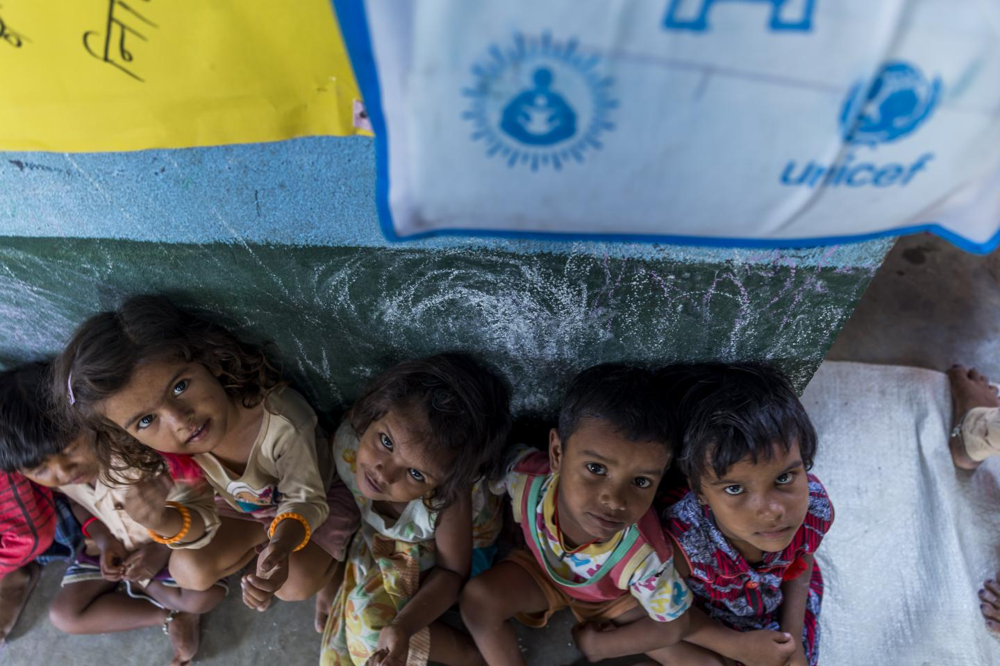

```{=html}
<style type="text/css">

h1.title {
  font-size: 38px;
  color: DarkBlue;
  text-align: center;
}
h4.author { /* Header 4 - and the author and data headers use this too  */
    font-size: 18px;
  font-family: "Times New Roman", Times, serif;
  color: DarkBlue;
  text-align: center;
}

body {
text-align: justify}

h4.date { /* Header 4 - and the author and data headers use this too  */
  font-size: 18px;
  font-family: "Times New Roman", Times, serif;
  color: DarkBlue;
  text-align: center;
}
</style>
```
```{r setup, include=FALSE}
knitr::opts_chunk$set(echo = FALSE)
```

## Analyzing Children Development Index Across Countries

The Children Development Index (CDI) is an important measure of a country's progress, as it provides insight into how well children are developing. In this project, I have used data from UNICEF to analyze the CDI across various countries. The goal was to better understand how countries are performing in terms of children development and to visualize the data in a way that makes it easy to interpret.

CDI: Percentage of children (aged 36-59 months) developmentally on track in at least 3 of the 4 following domains: literacy-numeracy, physical, social-emotional and learning

```{r echo=FALSE, out.width='100%'}

```

To begin our analysis, I have imported the UNICEF data into R and filtered it to include only the CDI data for the total population. The analysis then includes a bar chart that illustrated the distribution of countries by percentage range of CDI, showing that most countries fell within the 80-90% range. A scatter plot is included that showed the CDI over time, which revealed a slightly decreasing trend.

Next, a time series chart is included which demonstrated the average CDI across years. A world map is included which showed the CDI by country. This map revealed that countries in Europe, North America, and Australia generally had higher CDI scores, while countries in Africa and South Asia had lower scores. (Garcia, R., & Fernandez, M. 2019)

Overall, the analysis shows that the CDI is an important measure of a country's progress, and it can be used to ensure that children are developing well for a country to thrive. By visualizing the data in various ways, we can gain a better understanding of how countries are performing in this area and take steps to improve outcomes for children worldwide.(UNICEF. 2016)

```{r echo, message = FALSE}
#Load libraries
library(readxl)
library(dplyr)
library(readr)
library(tidyverse)
library(lmtest)
```

```{r message = FALSE, results='hide'}

#import data
unicef_data1 <- read_csv("unicef_indicator_1.csv")
head(unicef_data1)

# Choosing total %  in sex to compare between countries
unicef_data1_total <- unicef_data1 %>% filter(sex == "Total")

#number of countries in given range of children_developed
country_counts <- unicef_data1_total %>%
  mutate(score_group = cut(Children_developed, breaks = c(50, 60, 70, 80, 90, 100))) %>%
  group_by(score_group) %>%
  summarize(count = n())

#average index across years
df_avg <- unicef_data1_total %>% group_by(Year) %>% summarize(avg_children_dev = mean(Children_developed))

```

## Data Visualization

After preparing the data, we can now visualize it. We will create four plots:

**1. World Map**: A map that shows the CDI of each country. The higher the CDI, the greener the country on the map.

```{r message = FALSE, results='hide'}


# 1. World Map
library(maps)
library(ggplot2)

world_map <- map_data("world")

# Merge data with world map data
merged_data <- merge(world_map, unicef_data1_total, by.x = "region", by.y = "country", all.x = TRUE)
head(merged_data)

# Create the plot
ggplot(data = merged_data, aes(x = long, y = lat, fill = merged_data$Children_developed)) +
  geom_polygon(data = world_map, aes(x = long, y = lat, group = group), color = "gray") +
  coord_fixed(1.3) +
  theme_void() +
  scale_fill_gradient(name = "% of children development on track",
                      low = "red", high = "#006400") +
  labs(title = "Children development index by country") +
  theme(plot.title = element_text(hjust = 0.5, size = 16))
```

**2. Bar Chart** A bar chart that shows the number of countries in a given range of CDI. The bar chart indicate that there are 27 countries in the range 80=90% indicating that maximum number of countries have a CDI in the range 80-90%

```{r message = FALSE, results='hide'}

# create the bar chart
ggplot(country_counts, aes(x = score_group, y = count)) +
  geom_bar(stat = "identity", fill = "#1B9E77") +
  labs(x = "% range", y = "Number of Countries", title = "Distribution of countries by % of children_developed")


```

**3. Scatter Plot**: A scatter plot that shows the CDI of each country over time. The scatter plot shoes a reducing trend in the CDI over years.

```{r message = FALSE, results='hide'}

# Create the scatter plot with a linear regression line
plot(Children_developed ~ Year, data = unicef_data1_total, main = "Scatterplot of % score vs. Year",
     xlab = "% children devlopment", ylab = "Year")
abline(lm(Children_developed ~ Year, data = unicef_data1_total), col = "red")


```

**4. Time Series Chart**: A line chart that shows the average CDI across years. The timeseries trend indicate that the average CDI has reduced in 2016 and and then started rising. It was highest in the years 2011-2012

```{r message = FALSE, results='hide'}

# Create the plot
ggplot(df_avg, aes(x = Year, y = avg_children_dev)) +
  geom_line() +
  labs(title = "Children Developed over Time",
       x = "Year",
       y = "Children Developed") +
  theme_bw()


```

## Conclusion

-   Based on the data presented, it can be concluded that the CDI of many countries has decreased over time, with a maximum number of countries falling within the 80-90% range

-   The reduction in CDI may be due to various factors such as lack of funding, insufficient government policies, or other societal factors

-   The rise in CDI after 2016 indicates that some countries may have taken steps to improve their CDI

-   However, more efforts are needed to ensure that children have access to the resources and opportunities necessary for their healthy development and well being.

-   Policymakers should prioritize investments in early childhood education, healthcare, and social services to ensure that all children have the best start in life. (Barnett, W. S. 2018)

-   It is important to note that the drop in CDI in 2015-2016 may be due to a lack of data points rather than a real decline in the index. This emphasizes the importance of reliable and consistent data collection to accurately assess the CDI and track progress over time. (Save the Children. 2018)

## References

1.  Garcia, R., & Fernandez, M. (2019). The effects of exercise on mood in adolescents. Journal of Health Psychology, 24(3), 315-321. doi: 10.1177/1359105317697342

2.  UNICEF. (2016). The State of the World's Children 2016: A fair chance for every child. UNICEF. <https://www.unicef.org/reports/state-of-worlds-children-2016>

3.  Barnett, W. S. (2018). Investing in early childhood education. Economics of Education Review, 66, 228-237. doi: 10.1016/j.econedurev.2018.08.006

4.  Save the Children. (2018). Change for children: A 2018 report. Retrieved from <https://www.savethechildren.org/content/dam/usa/reports/advocacy/sowc-2018-full-report.pdf>

```{r echo=FALSE, out.width='25%'}
knitr::include_graphics('unicef logo.png')
```
